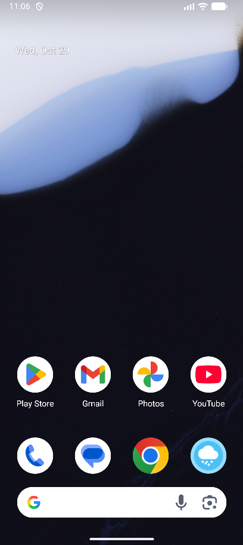
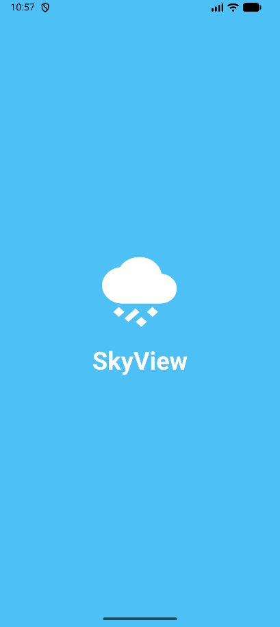
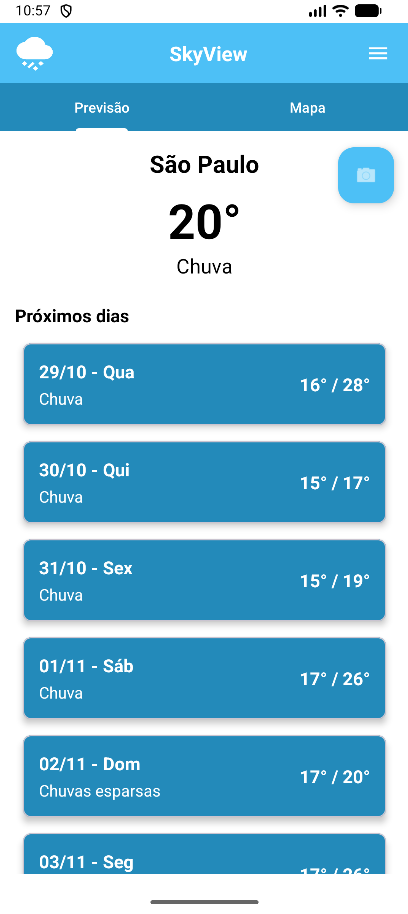
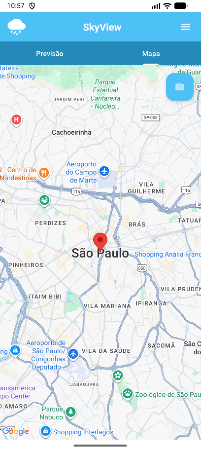
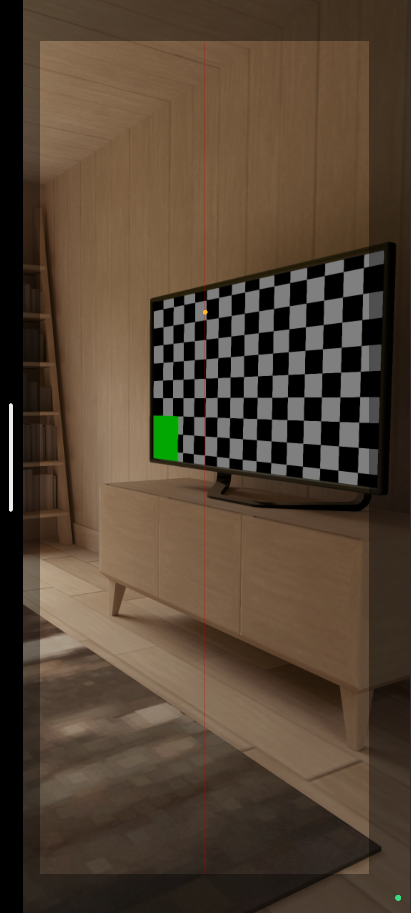
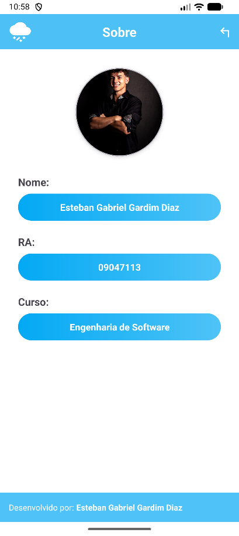

# SkyView

O SkyView é um aplicativo Android desenvolvido para fornecer previsões do tempo detalhadas e precisas, ajudando os usuários a se planejarem para as condições climáticas.

## ✨ Tecnologias Utilizadas

Este projeto foi construído utilizando tecnologias modernas e robustas do ecossistema Android:

*   **Java:** Linguagem de programação principal do aplicativo, garantindo uma base sólida e compatível com o ecossistema Android.
*   **Android SDK:** Conjunto de ferramentas essenciais para o desenvolvimento de aplicativos nativos para a plataforma Android.
*   **Retrofit:** Um cliente HTTP elegante e seguro para Android e Java, utilizado para realizar a comunicação com a API de previsão do tempo de forma eficiente.
*   **Componentes do Material Design:** Para a criação da interface do usuário (UI), seguindo as diretrizes do Google para um design moderno, intuitivo e agradável.
*   **Google Maps:** Integrado para exibir dados geográficos e permitir a visualização de mapas interativos.
*   **API HG Brasil:** API utilizada para obter os dados de previsão do tempo.

## 🚀 Como Executar o Projeto

Para executar o SkyView em seu ambiente de desenvolvimento, siga os passos abaixo:

1.  **Clone o repositório:** Clone este repositório para a sua máquina local.
2.  **Abra no Android Studio:** Abra o projeto na sua IDE Android Studio.
3.  **Sincronize o Gradle:** O Android Studio irá baixar e sincronizar todas as dependências necessárias para o projeto.
4.  **Execute o aplicativo:** Inicie o aplicativo em um emulador Android ou em um dispositivo físico conectado.

## 📸 Screenshots

  <strong>Ícone do App</strong> 
  

 

  <strong>Splashscreen do App</strong> 
  

 

  <strong>Previsão do App</strong> 
  

 

  <strong>Mapa do App</strong> 
  

 

  <strong>QR-Code do App</strong> 
  

 

  <strong>Sobre do App</strong> 
  

